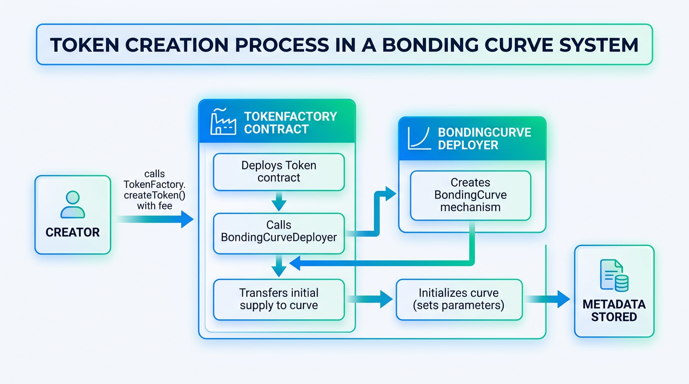
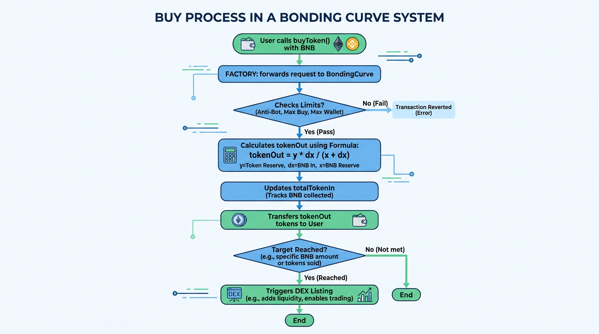
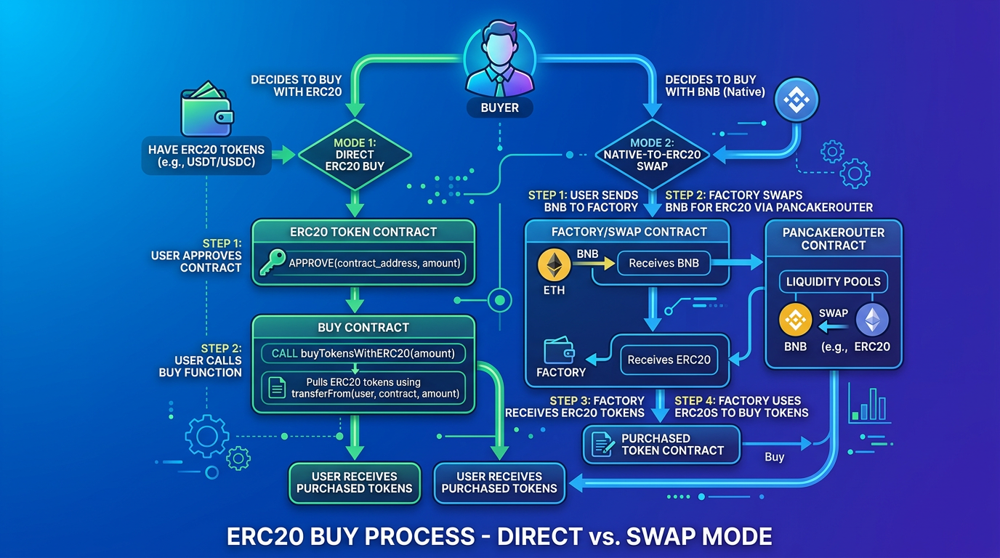
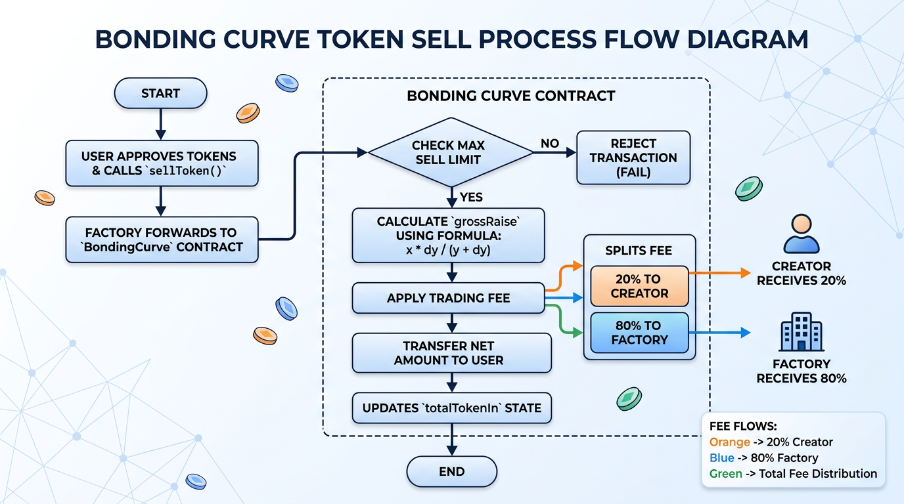
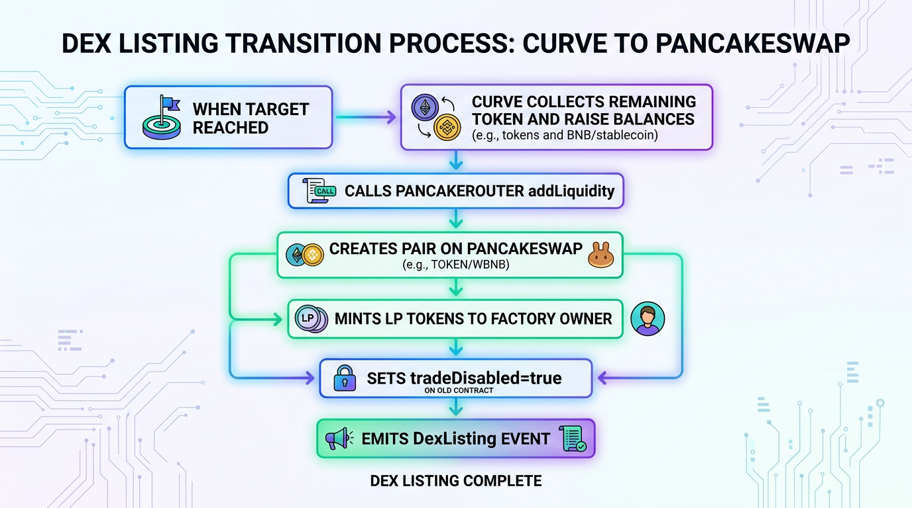

# Bonding System Architecture (Smart Contract)

This document describes the smart-contract architecture used by the bonding system, including pricing formulas, lifecycle flow, and fee distribution paths.

## 1) Components and Responsibilities

- `TokenFactory`
  - Entry point for token creation, buy, and sell.
  - Owns each deployed `BondingCurve`.
  - Stores token metadata and configurable parameters (`creationFee`, `initialSupply`, allowed raise tokens, oracle feeds).
  - Can route native buy to ERC20 raise pools via Pancake swap (`buyTokenWithBNB`).

- `BondingCurve`
  - Executes curve pricing logic (virtual constant-product model).
  - Holds token inventory and raise reserves during curve phase.
  - Applies anti-bot and limit checks (max buy/sell/wallet).
  - Triggers DEX listing when raise target is reached, then disables curve trading.

- `Token`
  - ERC20 meme token deployed per project.
  - Initial supply is minted to factory and then transferred to its curve.

- `BondingCurveDeployer`
  - Thin deployer to create new `BondingCurve` instances for the factory.

## 2) Pricing Model and Core Formulas

The curve uses a virtual constant-product invariant:

- `x = initialVirtualRaise + totalTokenIn`
- `y = floor(k / x)`
- `k = initialVirtualRaise * virtualTokenReserve`

Where:
- `x` = virtual raise reserve
- `y` = virtual token reserve
- `totalTokenIn` = net raise amount currently tracked in curve branch

### Buy Formula

For buy input `dx` (raise amount in base units):

- `tokenOut = floor(y * dx / (x + dx))`

This is equivalent to moving from `(x, y)` to `(x + dx, k/(x+dx))`.

### Sell Formula

For sell input `dy` (token amount):

- `grossRaise = floor(x * dy / (y + dy))`
- `fee = grossRaise * TRADING_FEE / 10000`
- `netRaise = grossRaise - fee`

`totalTokenIn` is reduced by `grossRaise` (not `netRaise`) to keep virtual accounting consistent.

### Spot Price and USD Price

- `priceInRaise = floor(x * 1e18 / y)`
- `priceInUsd = floor(priceInRaise * oraclePrice / (10^oracleDecimals))`

### Market Cap Normalized to USDT

- Market cap is reported in USDT-equivalent for all pools, including native and ERC20 raise tokens.
- Conversion ratio is taken strictly from Chainlink `AggregatorV3Interface` price feeds configured per raise token in factory settings.
- Each raise token must map to its own Chainlink feed (for example `BNB/USD`, `USDT/USD`, `BUSD/USD`) before token creation.
- Contract reads Chainlink `latestRoundData()` and uses feed decimals for normalization (`oracleDecimals`).
- Formula:
  - `marketCapInRaise = circulatingSupply * priceInRaise`
  - `marketCapInUsdt = floor(marketCapInRaise * oraclePrice / (10^oracleDecimals))`
- This keeps market-cap comparison consistent across pools that use different raise assets.

## 3) End-to-End Lifecycle Flow

## 3.1 Token Creation



1. Creator calls `TokenFactory.createToken(...)` with `creationFee`.
2. Factory deploys `Token`.
3. Factory deploys `BondingCurve` through `BondingCurveDeployer`.
4. Factory transfers full `initialSupply` to curve.
5. Factory initializes curve with token address.
6. Metadata is persisted in `tokens[tokenAddress]`.

## 3.2 Buy Flow (Native Raise Pool)



1. User calls `TokenFactory.buyToken(token, minOut)` with `msg.value`.
2. Factory forwards buy to curve `executeBuy{value: amount}(buyer, amount)`.
3. Curve computes `tokenOut` using buy formula and transfers token to buyer.
4. Curve updates `totalTokenIn += amount`.
5. If `totalTokenIn >= TARGET_TOKEN_BALANCE`, curve triggers DEX listing and sets `tradeDisabled = true`.

## 3.3 Buy Flow (ERC20 Raise Pool)



Two modes:

- **Direct ERC20 mode:**
  1. User approves curve for raise token.
  2. Factory calls `curve.executeBuy(buyer, raiseAmount)`.
  3. Curve pulls raise token from buyer and sends meme token to buyer.

- **Native-to-ERC20 swap mode:**
  1. User calls `buyTokenWithBNB(...)` with native coin.
  2. Factory swaps native coin to raise ERC20 via Pancake router.
  3. Factory approves curve and calls `executeBuy(buyer, cakeOut, true)`.
  4. Curve pulls ERC20 raise from factory and sends meme token to buyer.

## 3.4 Sell Flow



1. User approves curve to spend meme token.
2. User calls `TokenFactory.sellToken(token, tokenAmount, minRaiseOut)`.
3. Factory calls `curve.executeSell(seller, tokenAmount)`.
4. Curve computes `grossRaise`, applies fee, transfers `netRaise` to seller.
5. Fee is split between creator and factory owner.

## 3.5 DEX Listing Transition



When curve target is reached:

1. Curve adds liquidity to Pancake using remaining token + raise balance.
2. LP recipient is `MainOwner` (factory address configured as owner path).
3. Curve emits `DexListing(...)`.
4. Curve permanently disables internal trading (`tradeDisabled = true`, `isDex = true`).

## 4) Fee Flows

## 4.1 Creation Fee

- Source: `createToken(...)` payable fee.
- Current path:
  - `accumulatedFees += creationFee`
  - Immediate transfer to factory owner (`payable(owner()).transfer(creationFee)`).

## 4.2 Trading Fee (Sell Only)

- Buy path currently has no explicit protocol trading fee in curve logic.
- Sell path fee:
  - `fee = grossRaise * TRADING_FEE / 10000`
  - `creatorShare = fee * 2000 / 10000` (20%)
  - `factoryShare = fee - creatorShare` (80%)

Distribution asset is the raise asset of the pool:
- Native pool: native coin transfers.
- ERC20 pool: raise token transfers.

## 4.3 Other Balance Withdrawal

- `TokenFactory.withdrawFees()` withdraws factory native balance to owner.
- This is separate from sell-fee split (which happens inside curve), and usually covers residual native balance or other protocol-side receipts.

## 5) Safety and Limits in Runtime

- Access control:
  - Only factory can call buy/sell execution on curve (`onlyFactory`).
  - Administrative configs are owner-only.

- Runtime controls:
  - Anti-bot launch window with strict max buy.
  - Max buy per tx.
  - Max sell percent per user tx.
  - Max wallet cap.
  - Reentrancy guard on curve trade executions.

## 6) Operational Notes

- Router, wrapped-native address, and pair init code hash are currently hardcoded for BSC testnet in curve.
- Oracle feed must be configured per raise asset before token creation.
- For production, prefer multisig + timelock for owner operations and add oracle staleness checks.

## Development Commands

```shell
npx hardhat help
npx hardhat test
GAS_REPORT=true npx hardhat test
npx hardhat node
npx hardhat run scripts/deploy.js
```

## Contact Info
-[Telegram](https://t.me/tungreal)